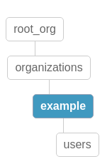

# plugin-its-you-online-auth

## Permissions

The organization structure is expected to look like this:

`root_org` is the name of your main organization in this case.

Members of the top-level organization (`root_org` in this example) have permission to everything.
 
Members of the `root_org.organizations.example.users` organization can only login, and members of `root_org.organizations.example` have admin permissions on that organization.

The organization `root_org.organizations` should never have any members/owners, as that would imply that those users have permission to every organization. Those users should just be added to the top-level organization(`root_org`) if this is what you want.